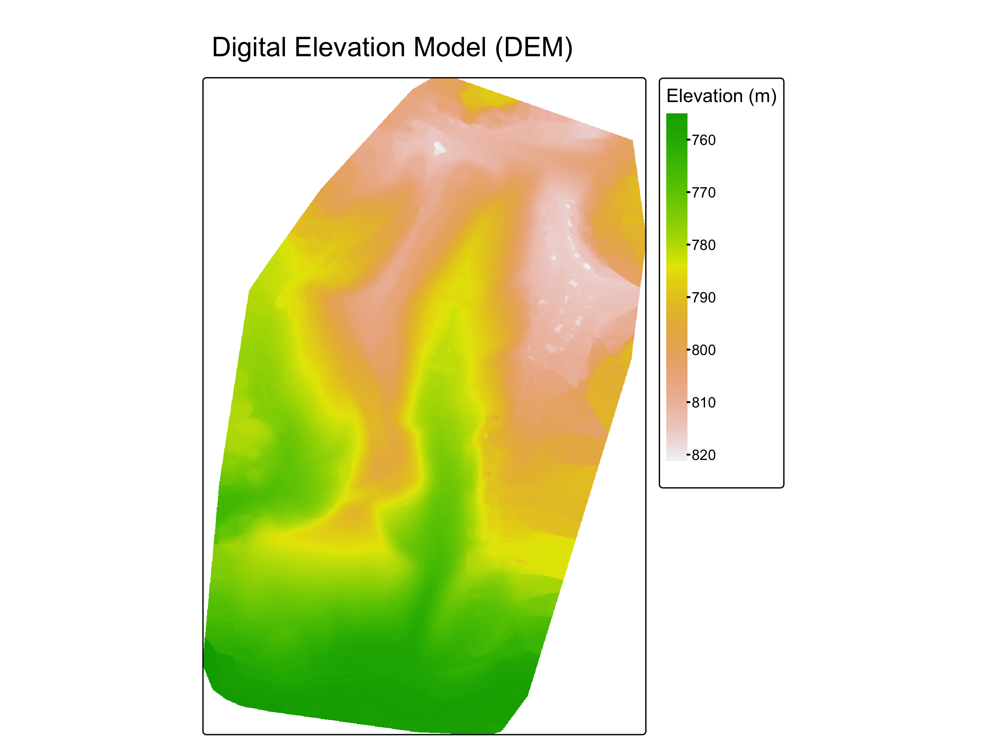
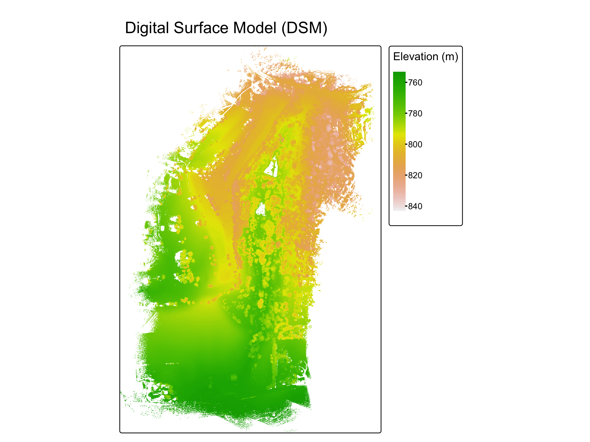
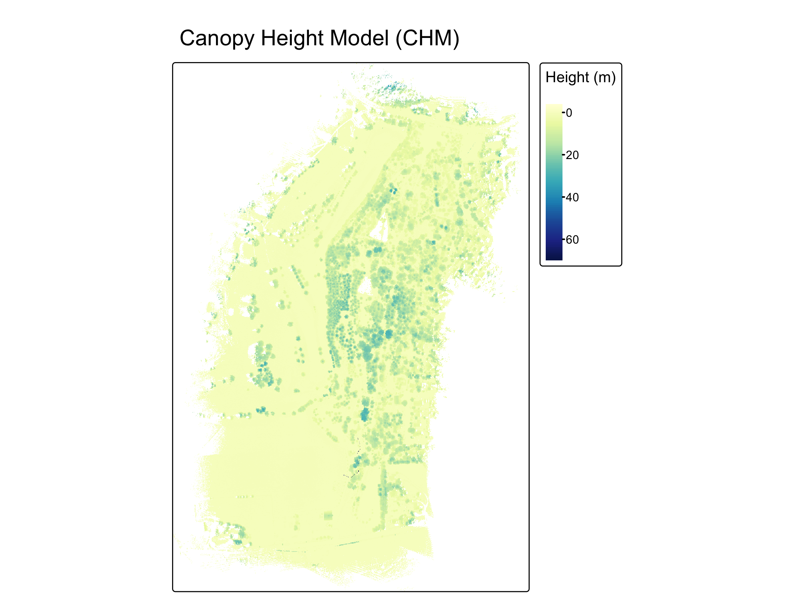

# LiDAR Terrain Modeling with R

This project demonstrates a workflow for processing drone LiDAR data to generate:

- Digital Elevation Model (DEM)
- Digital Surface Model (DSM)
- Canopy Height Model (CHM)

The analysis was completed using R and the lidR package.

## Dataset
Drone LiDAR point cloud (.las) collected at the University of Idaho Arboretum.

## Tools
- R
- lidR
- terra
- spatial analysis

## Workflow

1. Import LiDAR (.las) point cloud
2. Classify ground points using lidR
3. Generate DEM using terrain interpolation
4. Generate DSM from highest surface returns
5. Calculate CHM from normalized heights
6. Visualize terrain and canopy structure

## Outputs
- DEM
- DSM
- CHM
- visualization of canopy structure

## Purpose
This project demonstrates LiDAR data processing, spatial modeling, and environmental data analysis using reproducible R workflows.

## Example Outputs

### Digital Elevation Model

### Digital Surface Model

### Canopy Height Model

